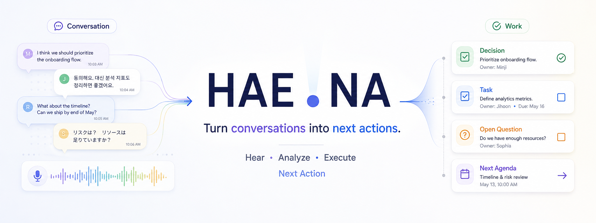

# HAE.NA — Turn conversations into next actions



**회의를 한 사람의 업무 기억과 실행으로 바꾸는 로컬 우선 macOS 앱입니다.**

회의는 여러 사람이 하지만, 회의가 끝난 뒤 내용을 기억하고 실행해야 하는 것은 결국 한 사람입니다.
HAE.NA는 그 한 사람을 위한 앱입니다. 녹음하거나 음성 파일을 불러오면 전사하고, 결정·업무·미해결
질문·다음 아젠다를 뽑아 제안하며, 사용자가 승인한 것만 프로젝트 상태로 남깁니다.

> ⚠️ **이 저장소의 배포본은 서명·공증되지 않은 Developer Preview입니다.**
> 설치 시 macOS 경고가 나타납니다. [설치 방법](#unsigned-빌드-설치)을 반드시 읽어주세요.

## 제품 정체성 — Solo-first, Share-ready, Team-later

- **Solo-first** — 협업 SaaS가 아닙니다. 앱 사용자는 이 Mac을 쓰는 단일 사용자, 즉 "나"입니다.
- **Share-ready** — 협업은 계정이 아니라 사용자가 통제하는 산출물(Markdown·클립보드)로 지원합니다.
- **Team-later** — 조직·초대·권한·실시간 동기화는 개인용 제품이 실제로 잘 쓰인 뒤에 검토합니다.

회의 참석자는 앱 계정이 아니라 회의 맥락 속의 사람(Person)입니다. 로그인도, 서버도, 계정도 없습니다.

## 지금 할 수 있는 것

- **마이크 녹음** — 앱에서 회의를 녹음하고 바로 전사로 넘깁니다
- **음성 파일 불러오기** — `mp3` `mp4` `mpeg` `mpga` `m4a` `wav` `webm`, 최대 25MB
- **텍스트 회의록 붙여넣기** — 녹음이 없어도 회의록만으로 시작할 수 있습니다
- **전사와 화자 구분** — 타임스탬프와 화자가 붙은 원문
- **화자 확인** — 익명 화자(`Speaker 1`)를 실제 참석자와 연결. 전사·분석을 막지 않는 선택 기능
- **업무 상태 추출** — 결정 / 업무 / 미해결 질문 / 다음 아젠다. 근거 인용과 확신도가 함께 표시되며,
  **승인 전에는 확정된 상태로 취급되지 않습니다**
- **검토와 수정** — 승인·제외, 담당자·마감일 변경
- **회의 결과 화면** — 회의를 열면 **회의 결과**가 먼저 나오고 **원문**은 옆 탭에 있습니다. 녹음·불러오기·
  붙여넣기가 끝나면 방금 만든 회의의 결과 화면으로 바로 이동합니다
- **개인 홈** — 모든 프로젝트를 합산해 확인 필요·진행 업무·미해결 질문·다음 아젠다를 한 화면에
- **지금 할 일** — 홈 맨 위에 지금 해야 할 **한 건만** 강조합니다. 검토를 기다리는 AI 제안이 있으면
  그것을, 없으면 마감이 지났거나 가장 임박한 내 업무를 제안하고, 누르면 해당 위치로 이동합니다
- **내 업무** — 이름을 설정하고 본인에 해당하는 참석자를 연결하면 내 업무만 구분해 볼 수 있습니다
- **내 업무 알림** — 마감일이 있는 확정된 내 업무의 알림 시각을 직접 확인해 macOS 로컬 알림으로
  예약합니다. 앱을 다시 열어도 유지되며 업무가 끝나면 자동으로 취소됩니다
- **Agent 기록** — 알림 예약·취소, 화면 표시·열기, 실행 시각 경과, 관련 업무 완료를 이 Mac의
  최소 로컬 기록으로 확인하고 선택적으로 유용성 피드백을 남길 수 있습니다
- **원본 오디오 재생** — 저장된 녹음을 다시 듣기(재생/일시정지, 처음부터, 현재 시간·전체 길이)
- **Markdown 내보내기·복사** — 프로젝트 현재 상태, 회의 전사 원문

## 요구 사항

| 항목 | 버전 |
| --- | --- |
| macOS | 14.0 이상 |
| Xcode | Swift 6 툴체인을 포함한 버전 |
| [XcodeGen](https://github.com/yonaskolb/XcodeGen) | 프로젝트 파일 생성용 |

외부 런타임 의존성은 **없습니다.** Apple 프레임워크(SwiftUI, AVFoundation, Security 등)만 사용합니다.

## 소스에서 빌드하기

```bash
brew install xcodegen
```

```bash
xcodegen generate && open HAENA.xcodeproj
```

Xcode에서 `HAENA` 스킴을 선택해 실행하면 됩니다. 명령줄만으로 빌드하려면:

```bash
xcodebuild -project HAENA.xcodeproj -scheme HAENA -configuration Debug build
```

`HAENA.xcodeproj`는 `project.yml`에서 생성됩니다. **프로젝트 파일을 직접 편집하지 말고
`project.yml`을 고친 뒤 다시 생성하세요.**

## unsigned 패키지 만들기

```bash
./scripts/package-unsigned.sh
```

`dist/` 아래에 `HAE.NA-<버전>-<빌드>-unsigned.app.zip`과 `.sha256` 체크섬 파일이 생깁니다.
격리된 DerivedData에서 Release 설정으로 빌드하며, 기존 산출물을 조용히 덮어쓰지 않습니다.

## unsigned 빌드 설치

이 앱은 **Apple Developer ID로 서명되지 않았고 공증(Notarization)도 받지 않았습니다.**
그래서 macOS가 "확인되지 않은 개발자" 또는 "손상되었기 때문에 열 수 없습니다"라고 경고합니다.
이는 앱이 위험하다는 뜻이 아니라, **Apple이 이 빌드를 확인한 적이 없다는 뜻**입니다.

설치 전에 반드시 **출처와 SHA-256 체크섬을 확인하세요.**

```bash
shasum -a 256 HAE.NA-0.1.0-1-unsigned.app.zip
```

출력값이 릴리스에 공개된 값과 **한 글자도 다르지 않아야** 합니다.

### 여는 방법

1. 압축을 풀고 `HAE.NA.app`을 `/Applications`로 옮깁니다
2. **Finder에서 앱을 우클릭 → 열기** (더블클릭이 아니라 우클릭입니다)
3. 경고 대화상자에서 **열기**를 누릅니다

우클릭 → 열기로도 열리지 않으면:

4. **시스템 설정 → 개인정보 보호 및 보안**을 열고, 아래쪽 "HAE.NA이(가) 차단되었습니다" 옆의
   **확인 없이 열기**를 누른 뒤 다시 실행합니다

> 🔒 Gatekeeper를 전역으로 끄는 명령(`spctl --master-disable`)이나 `xattr -dr`로 격리 속성을
> 일괄 제거하는 방법은 **권장하지 않습니다.** 이 앱 하나 때문에 시스템 전체의 보호를 낮출
> 이유가 없습니다. 위의 우클릭 → 열기로 충분합니다.

## OpenAI API 키 설정 (BYOK)

HAE.NA는 **개발자 공용 키를 포함하지 않습니다.** 전사와 AI 추출을 쓰려면 본인의 OpenAI API 키가
필요합니다(Bring Your Own Key).

1. 앱 실행 → 홈 화면의 **AI 설정**
2. API 키를 붙여넣고 **저장**
3. 선택: **연결 확인** — 모델을 실행하지 않는 목록 조회로 인증만 검사하므로 **사용료가 발생하지
   않습니다**

키는 이 Mac의 **Keychain**에만 저장됩니다(`com.haena.HAENA` / `openai-api-key`).
저장한 뒤에는 화면에 다시 표시되지 않으며, 상태로 "설정됨"만 보여줍니다.

개발·테스트용으로 `OPENAI_API_KEY` 환경변수도 지원하며, **환경변수가 있으면 Keychain보다
우선합니다.**

### 비용과 데이터에 대해

- **API 사용료는 입력한 키의 OpenAI 계정에서 발생합니다.**
- **ChatGPT 구독료와 API 사용료는 서로 별개입니다.** ChatGPT Plus를 쓰고 있어도 API는 따로
  과금됩니다.
- 본인 계정의 키만 사용하세요.
- 권한을 제한한 Project API 키를 만들고 OpenAI에서 사용 한도를 설정해두시길 권합니다.
- **전사와 추출을 실행하면 회의 오디오와 전사 내용이 OpenAI로 전송됩니다.** 자세한 내용은
  [PRIVACY.md](PRIVACY.md)를 읽어주세요.

사용 모델: 전사 `gpt-4o-transcribe-diarize`, 추출 `gpt-5.6`

## 로컬 데이터가 저장되는 위치

| 내용 | 위치 |
| --- | --- |
| 프로젝트·회의·전사·업무 상태 | `~/Library/Application Support/com.haena.HAENA/projects.json` |
| 로컬 사용자 프로필 | `~/Library/Application Support/com.haena.HAENA/profile.json` |
| 로컬 알림 예약·취소 이력 | `~/Library/Application Support/com.haena.HAENA/agent-jobs.json` |
| Agent 알림 사건·선택적 피드백 | `~/Library/Application Support/com.haena.HAENA/agent-ledger.json` |
| 앱이 보관하는 오디오 사본 | `~/Library/Application Support/com.haena.HAENA/Audio/` |
| OpenAI API 키 | macOS Keychain (`com.haena.HAENA` / `openai-api-key`) |
| 녹음 중 임시 파일 | 시스템 임시 폴더 (앱 시작 시 정리) |

### 삭제하는 방법

- **프로젝트·회의** — 앱에서 `프로젝트 보기` → 프로젝트/회의 삭제. 연결된 오디오 사본도 함께 지워집니다
- **API 키** — `AI 설정` → 삭제. 키를 지워도 저장된 프로젝트·녹음·전사는 남습니다
- **전부** — 앱을 종료하고 위 `com.haena.HAENA` 폴더를 삭제하세요. Keychain 항목은 *키체인 접근*
  앱에서 `com.haena.HAENA`를 검색해 지울 수 있습니다

## 현재 제한사항

- **서명·공증되지 않았습니다.** 설치에 위의 수동 절차가 필요합니다
- 영상 파일에서 오디오 추출은 미구현
- 영어 등 다른 언어는 전체 회의 기준으로 검증되지 않았습니다(한국어 위주로 확인)
- 혼합 언어 자동 감지, 회의 후 번역 미구현
- 전사 품질(WER·화자 분리 정확도)의 정량 측정은 아직 하지 않았습니다
- Agent 기록은 ActionItem 로컬 알림의 사실 사건만 다룹니다. 범용 Agent 실행 이력·원격 분석은 없습니다
- 다중 사용자·팀·동기화 없음. 의도된 범위입니다
- 앱이 여러 개 동시에 실행되면 같은 저장 파일을 두고 경합할 수 있습니다
- 삭제는 일반 파일 삭제이며 secure erase가 아닙니다

## 로드맵

**약속이 아니라 방향입니다.** 순서와 내용은 실제 사용 결과에 따라 바뀝니다.

- 근거·전사 지점으로 오디오 이동
- 마지막 확인 이후 변화 요약
- 공유용 회의 브리핑
- 전사 품질 벤치마크와 한국어 특화 모델 평가
- 설치 장벽이 검증을 방해한다고 판단되면 Developer ID 서명·공증

## 버그 신고와 기여

- 버그·제안은 GitHub Issues로 올려주세요.
- **이슈에 회의 오디오, 전사 원문, API 키, `projects.json`, `agent-jobs.json`, `agent-ledger.json`을 첨부하지 마세요.**
  무엇을 보내도 되고 안 되는지는 [SECURITY.md](SECURITY.md)에 정리했습니다.
- 코드 기여는 [CONTRIBUTING.md](CONTRIBUTING.md)를 참고해주세요.

## License

**Apache License 2.0**

```
Copyright 2026 HAE.NA contributors

Licensed under the Apache License, Version 2.0 (the "License");
you may not use this file except in compliance with the License.
You may obtain a copy of the License at

    http://www.apache.org/licenses/LICENSE-2.0

Unless required by applicable law or agreed to in writing, software
distributed under the License is distributed on an "AS IS" BASIS,
WITHOUT WARRANTIES OR CONDITIONS OF ANY KIND, either express or implied.
See the License for the specific language governing permissions and
limitations under the License.
```

전문은 [LICENSE](LICENSE)를 참고하세요. MIT 대신 Apache-2.0을 선택한 이유는 **명시적인 특허
라이선스 부여와 기여자 특허 보복 방지 조항** 때문입니다. 이 앱은 회의 데이터 처리와 AI 파이프라인을
다루고 앞으로 provider·모델이 확장될 수 있어, 기여자와 사용자 양쪽에 그 조항이 있는 편이
안전합니다.

**OpenAI API와 모델은 이 라이선스의 적용 대상이 아닙니다.** 별도의 OpenAI 약관을 따릅니다 —
[THIRD_PARTY_NOTICES.md](THIRD_PARTY_NOTICES.md)를 참고하세요.
